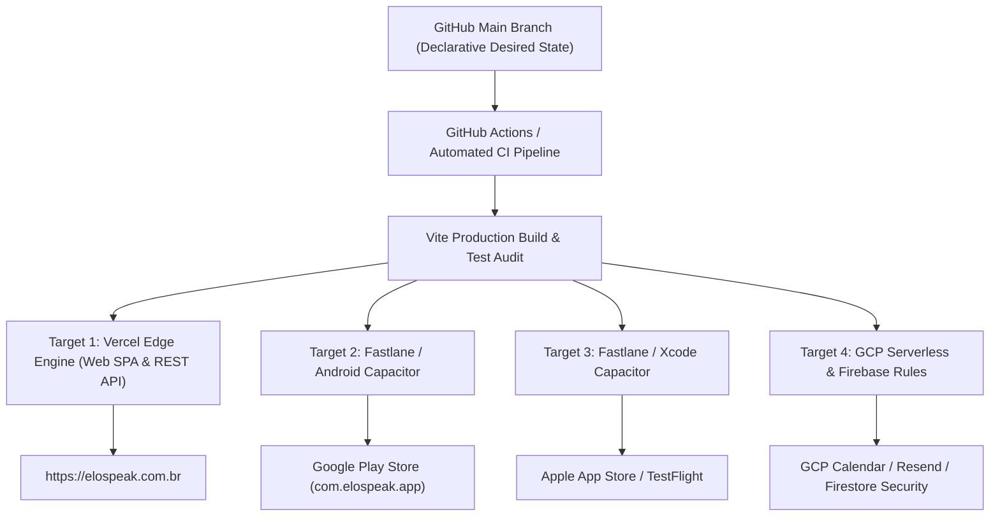

# Elo! Language Platform: Repository Notes & Core Architecture 🏛️

**Target Environment**: React 19 / Vite 6 / Vercel Serverless / Firestore NoSQL
**Design Philosophy**: Separated, decoupled, strict-mode asynchronous operations optimized for high-performance mobile and B2B client delivery.

---

## 1. Directory Topology

The repository relies on a strict separation of configuration, serverless edge routes, and interactive client layers. Do not extract client source logic into the root directory.

```text
├── .github/workflows/          # CI/CD automated validation pipelines
├── api/                        # Vercel Serverless Functions tier (Google, Resend APIs)
├── public/                     # Static assets, web manifests, and platform icons
├── src/                        # Isolated Client Application Layer
│   ├── components/             # Atomic UI structures (booking, dashboard, ui)
│   ├── lib/                    # SDK initializations & state machines (firestore, xp)
│   ├── pages/                  # Route-level view boundaries (AiCoachPage, LessonPage)
│   └── utils/                  # Safe date parsers & procedural sound logic
├── firestore.indexes.json      # Production query optimization manifests
├── firestore.rules             # Row-level protection matrices (request.auth.uid)
└── vercel.json                 # Serverless configuration, redirects, and Cron pipelines
```

---

## 2. Path Aliasing Configuration

To prevent fragile relative imports across the app, absolute paths are locked down in `tsconfig.json` and `vite.config.ts`. Always import internal modules using the `@` mapping namespace:

*   **`@/*`** -> maps to `/src/*`
*   **`@components/*`** -> maps to `/src/components/*`
*   **`@lib/*`** -> maps to `/src/lib/*`
*   **`@utils/*`** -> maps to `/src/utils/*`

---

## 3. Core Architectural Invariants

To prevent regressions during feature branches and B2B expansion, the following implementation patterns are non-negotiable:

### A. Non-Blocking Background Operations
All auxiliary API dispatches (e.g., transactional emails via Resend, background calendar syncs) must be completely decoupled from primary UI transactions. 
* Trigger them asynchronously (`fetch().catch()`).
* Do not block localized state mutations or hold up UI responsiveness for network flights.

### B. Defensive Date Manipulation (Safari Guardrail)
* Never pass hyphenated ISO strings directly into `new Date()` (crashes Safari date parsing engines).
* All chronological calculations must leverage manual split parsing via the global utility [dateParser.ts](file:///c:/Users/DELL%20I5%20DE%208%C2%BA/Soft%20Dev/elo-fluxa-rj/src/utils/dateParser.ts).
* Normalize all structural calendar views strictly against Rio de Janeiro local time strings (`America/Sao_Paulo`) prior to comparisons.

### C. State Mutability Rules
* Never mutate state collections directly via push arrays or raw assignments.
* All interactive view updates (such as grays, status shifts, or loading flags) must perform a functional update layout (`setX(prev => [...prev, newElement])`) to guarantee instant DOM updates across React 19 concurrent pipelines.

---

## 4. B2B Corporate Expansion Directives

To scale from B2C premium tiers to high-margin employee benefit seating contracts, the codebase supports structural tenancy:

1.  **Sub-Collection Scoping**: The core flat user schema (`/users/{uid}`) contains optional B2B properties to target corporate domains:
    *   `organizationId?: string;` (UUID of the company/enterprise partner)
    *   `corporateCredits?: number;` (Pre-allocated tutor hours or AI call tokens)
2.  **Defensive Validation**: The update profile pipeline [firestore.ts](file:///c:/Users/DELL%20I5%20DE%208%C2%BA/Soft%20Dev/elo-fluxa-rj/src/lib/firestore.ts) dynamically enforces type safety on B2B schema attributes before submitting documents to prevent data corruption.
3.  **Dynamic Corporate Modules**: The path structure inside your components supports loading corporate-specific configurations (e.g., locking/unlocking localized vocabulary hints based on company-wide professional focus domains).

---

## 5. GitOps & Argo CD-Inspired Cross-Platform Continuous Delivery 🚀

To scale deployment across Web (Vercel Edge), Mobile (Android TWA/Capacitor & iOS TestFlight), and GCP Cloud APIs, ELO! adopts **Argo CD-inspired GitOps principles**:

### A. Declarative Desired State (Single Source of Truth)
* **Git as the Source of Truth**: The `main` branch declaratively specifies the desired runtime state for Web, Mobile, and API services:
  * Web Edge Config: `vercel.json` & `vite.config.ts`
  * Android Manifest: `twa-manifest.json` & `capacitor.config.json` (`com.elospeak.app`)
  * iOS Bundle: `capacitor.config.json` (`com.elospeak.app`)
  * Database Security: `firestore.rules` & `firestore.indexes.json`

### B. Multi-Target Automated Deployment Pipeline



### C. Core GitOps Operating Principles
1. **Automated Synchronization & Reconcile Loops**: Every commit pushed to `main` triggers automated CI validation and instant Vercel Edge deployment.
2. **Immutability & Zero-Downtime Rollbacks**: Deployments use blue-green Edge routing. If an anomaly is detected, instant rollback to previous git commit hashes is executed with 1 click.
3. **Mobile Build Automation**: Version tag releases (`v1.x.x`) trigger Fastlane CI workflows to package, sign, and push Android AAB and iOS IPA bundles to Google Play and Apple TestFlight automatically.

