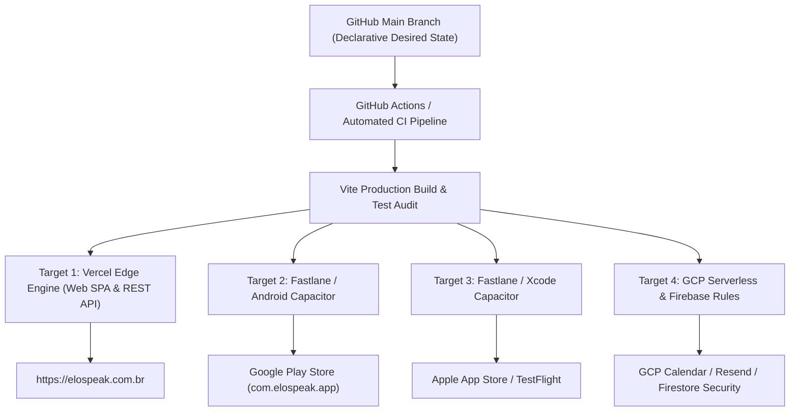

# Elo! Language Platform: Repository Notes & Core Architecture 🏛️

**Target Environment**: React 19 / Vite 6 / Vercel Serverless / Firestore NoSQL
**Design Philosophy**: Separated, decoupled, strict-mode asynchronous operations optimized for high-performance mobile and B2B client delivery.

---

## 1. Directory Topology

The repository relies on a strict separation of configuration, serverless edge routes, and interactive client layers. Do not extract client source logic into the root directory.

```text
├── .github/workflows/          # CI/CD automated validation pipelines
├── api/                        # Vercel Serverless Functions tier (Google, Resend APIs)
├── public/                     # Static assets, web manifests, and platform icons
├── src/                        # Isolated Client Application Layer
│   ├── components/             # Atomic UI structures (booking, dashboard, ui)
│   ├── lib/                    # SDK initializations & state machines (firestore, xp)
│   ├── pages/                  # Route-level view boundaries (AiCoachPage, LessonPage)
│   └── utils/                  # Safe date parsers & procedural sound logic
├── firestore.indexes.json      # Production query optimization manifests
├── firestore.rules             # Row-level protection matrices (request.auth.uid)
└── vercel.json                 # Serverless configuration, redirects, and Cron pipelines
```

---

## 2. Path Aliasing Configuration

To prevent fragile relative imports across the app, absolute paths are locked down in `tsconfig.json` and `vite.config.ts`. Always import internal modules using the `@` mapping namespace:

*   **`@/*`** -> maps to `/src/*`
*   **`@components/*`** -> maps to `/src/components/*`
*   **`@lib/*`** -> maps to `/src/lib/*`
*   **`@utils/*`** -> maps to `/src/utils/*`

---

## 3. Core Architectural Invariants

To prevent regressions during feature branches and B2B expansion, the following implementation patterns are non-negotiable:

### A. Non-Blocking Background Operations
All auxiliary API dispatches (e.g., transactional emails via Resend, background calendar syncs) must be completely decoupled from primary UI transactions. 
* Trigger them asynchronously (`fetch().catch()`).
* Do not block localized state mutations or hold up UI responsiveness for network flights.

### B. Defensive Date Manipulation (Safari Guardrail)
* Never pass hyphenated ISO strings directly into `new Date()` (crashes Safari date parsing engines).
* All chronological calculations must leverage manual split parsing via the global utility [dateParser.ts](file:///c:/Users/DELL%20I5%20DE%208%C2%BA/Soft%20Dev/elo-fluxa-rj/src/utils/dateParser.ts).
* Normalize all structural calendar views strictly against Rio de Janeiro local time strings (`America/Sao_Paulo`) prior to comparisons.

### C. State Mutability Rules
* Never mutate state collections directly via push arrays or raw assignments.
* All interactive view updates (such as grays, status shifts, or loading flags) must perform a functional update layout (`setX(prev => [...prev, newElement])`) to guarantee instant DOM updates across React 19 concurrent pipelines.

### D. Widget Error Boundaries (Dashboard Isolation)
* Every dashboard widget **must** be wrapped in `<WidgetErrorBoundary widgetName="...">` ([WidgetErrorBoundary.tsx](file:///c:/Users/DELL%20I5%20DE%208%C2%BA/Soft%20Dev/elo-fluxa-rj/src/components/dashboard/WidgetErrorBoundary.tsx)).
* This prevents a single widget crash (e.g., malformed Firestore date) from taking down the entire student dashboard.
* The boundary renders a "Recarregar Widget" retry button and logs the component name for debugging.

### E. Admin View Event Bus (`setAdminViewMode`)
* Admin/Student view toggling is managed via a custom event bus in [adminView.ts](file:///c:/Users/DELL%20I5%20DE%208%C2%BA/Soft%20Dev/elo-fluxa-rj/src/utils/adminView.ts).
* `setAdminViewMode(boolean)` writes to `sessionStorage` and dispatches `CustomEvent('elo_admin_view_changed')`.
* All components (Navbar, Dashboard, Admin) listen to this event — **never** call toggle functions directly across component boundaries.
* `sessionStorage` access is wrapped in `try/catch` for restricted environments (private browsing, iframes).

### F. Promise.race Timeout Pattern (Calendar API)
* The booking flow in [VisualSlotPicker.tsx](file:///c:/Users/DELL%20I5%20DE%208%C2%BA/Soft%20Dev/elo-fluxa-rj/src/components/booking/VisualSlotPicker.tsx) uses `Promise.race` with a 3.5s timeout to prevent the slot confirmation from hanging on cold-start API delays.
* **Critical**: When the calendar promise wins the race, `clearTimeout()` must be called. When the timeout wins, `createCallPromise.catch(() => {})` must suppress the unhandled rejection from the still-pending calendar promise.
* All `fetch()` calls in [googleCalendar.ts](file:///c:/Users/DELL%20I5%20DE%208%C2%BA/Soft%20Dev/elo-fluxa-rj/src/lib/googleCalendar.ts) also carry `AbortSignal.timeout(10000)` as a safety net.

### G. Admin Authorization (`isAuthorizedEmail`)
* Admin access is resolved via a dual check across the codebase:
  1. **Hardcoded authorized emails/domains**: `mramsayo@gmail.com`, `mramsay0@gmail.com`, `erneleducation@gmail.com`, `@elospeak.com.br`, `@elospeak.com`
  2. **Environment UID match**: `user.uid === VITE_ADMIN_UID`
* This pattern is used in `Navbar.tsx`, `Dashboard.tsx`, `useAdminGuard.ts`, and `firestore.rules`.
* **Both desktop and mobile** nav menus must use `isAuthorizedEmail` — never restrict to UID-only checks.

### H. Service Account Credentials (`parseServiceAccountCredentials`)
* All serverless endpoints in [api/calendar.ts](file:///c:/Users/DELL%20I5%20DE%208%C2%BA/Soft%20Dev/elo-fluxa-rj/api/calendar.ts) use a shared `parseServiceAccountCredentials()` helper.
* Handles: `GOOGLE_SERVICE_ACCOUNT_JSON` or `GOOGLE_SERVICE_ACCOUNT_KEY` env vars, single-quote wrapping, escaped `\\n` → `\n` in private keys.
* Wrapped in `try/catch` — returns `null` on malformed JSON to gracefully fall back to mock/Jitsi mode.

---

## 4. B2B Corporate Expansion Directives

To scale from B2C premium tiers to high-margin employee benefit seating contracts, the codebase supports structural tenancy:

1.  **Sub-Collection Scoping**: The core flat user schema (`/users/{uid}`) contains optional B2B properties to target corporate domains:
    *   `organizationId?: string;` (UUID of the company/enterprise partner)
    *   `corporateCredits?: number;` (Pre-allocated tutor hours or AI call tokens)
2.  **Defensive Validation**: The update profile pipeline [firestore.ts](file:///c:/Users/DELL%20I5%20DE%208%C2%BA/Soft%20Dev/elo-fluxa-rj/src/lib/firestore.ts) dynamically enforces type safety on B2B schema attributes before submitting documents to prevent data corruption.
3.  **Dynamic Corporate Modules**: The path structure inside your components supports loading corporate-specific configurations (e.g., locking/unlocking localized vocabulary hints based on company-wide professional focus domains).

---

## 5. GitOps & Argo CD-Inspired Cross-Platform Continuous Delivery 🚀

To scale deployment across Web (Vercel Edge), Mobile (Android TWA/Capacitor & iOS TestFlight), and GCP Cloud APIs, ELO! adopts **Argo CD-inspired GitOps principles**:

### A. Declarative Desired State (Single Source of Truth)
* **Git as the Source of Truth**: The `main` branch declaratively specifies the desired runtime state for Web, Mobile, and API services:
  * Web Edge Config: `vercel.json` & `vite.config.ts`
  * Android Manifest: `twa-manifest.json` & `capacitor.config.json` (`com.elospeak.app`)
  * iOS Bundle: `capacitor.config.json` (`com.elospeak.app`)
  * Database Security: `firestore.rules` & `firestore.indexes.json`

### B. Multi-Target Automated Deployment Pipeline



### C. Core GitOps Operating Principles
1. **Automated Synchronization & Reconcile Loops**: Every commit pushed to `main` triggers automated CI validation and instant Vercel Edge deployment.
2. **Immutability & Zero-Downtime Rollbacks**: Deployments use blue-green Edge routing. If an anomaly is detected, instant rollback to previous git commit hashes is executed with 1 click.
3. **Mobile Build Automation**: Version tag releases (`v1.x.x`) trigger Fastlane CI workflows to package, sign, and push Android AAB and iOS IPA bundles to Google Play and Apple TestFlight automatically.

---

## 6. Error Handling & Mobile Resiliency Guardrails 🛡️

To prevent regressions across mobile devices and desktop browsers, all developers and AI agents must adhere to these defensive patterns:

### A. Auth Timeout Guard Pattern
On mobile browsers (especially iOS Safari on 4G/5G connections), Firebase Auth `onAuthStateChanged` can take several seconds to complete its initial handshake.
* **Invariant:** `useAuth.ts` must maintain a `setTimeout(() => setLoading(false), 1500)` fallback timer.
* If Firebase takes longer than 1.5s, the UI must proceed and render public routes instead of locking the user in a perpetual loading spinner.

### B. Safe Storage Access in Private Browsing
iOS Safari and in-app webviews (Instagram, WhatsApp, TikTok) throw security exceptions when accessing `sessionStorage` or `localStorage` in restricted modes.
* **Invariant:** Every `localStorage` and `sessionStorage` read/write must be wrapped in `try/catch` blocks. Never access storage directly in the global scope or in component renders without protection.

### C. Desktop Scroll Container Preservation
Applying `touch-action: pan-x pan-y`, `overscroll-behavior: none`, or `overflow-x: hidden` to the root `<html>` tag breaks native desktop mousewheel and trackpad scrolling on Chromium and WebKit browsers.
* **Invariant:** Only apply overflow boundaries to `<body>` (`overflow-x: hidden; position: relative; width: 100%; min-height: 100vh;`) or dedicated inner wrappers. The `<html>` selector must remain clean.

### D. Apple Guideline 5.1.1(v) & LGPD Account Deletion Protocol
Apple strictly rejects mobile applications with user registration if they lack an in-app account deletion mechanism.
* **Invariant:** `ProfilePage.tsx` must maintain the **"Excluir Minha Conta"** action. It must delete the Firestore `/users/{uid}` document, call `deleteUser(authUser)`, sign out the session, and redirect to the landing page.

### E. Localized Auth Error Translation
Firebase Auth throws technical error codes (e.g. `auth/popup-closed-by-user`, `auth/unauthorized-domain`, `auth/email-already-in-use`).
* **Invariant:** All auth interfaces (`LoginModal.tsx`, `Login.tsx`, `Signup.tsx`) must route error objects through `getAuthErrorMessage(err)` in `src/utils/authErrors.ts` to present user-friendly Portuguese error messages.

### F. Post-Auth Document Provisioning (Existence-Guarded Invariant)
When users log in via Google SSO or Email, attempting an unconditional `setDoc(userRef, { role: 'student', plan: 'free', ... }, { merge: true })` on an existing document triggers Firestore Security Rules `allow update` validation. Because regular users are forbidden from modifying their `role` or `plan`, Firestore throws `Missing or insufficient permissions`.
* **Invariant:** All auth flows must first perform `const userSnap = await getDoc(userRef)`.
  * **New Users (`!userSnap.exists()`):** Execute `setDoc` with initial `role: 'student'`, `plan: 'free'`, `xp: 0`, and `hasSeenOnboarding: false`.
  * **Existing Users (`userSnap.exists()`):** Execute `updateDoc` updating ONLY non-restricted fields (`lastActiveDate`, `photoURL`, `displayName`).
* **Invariant (Firestore Rules):** `allow update` in `firestore.rules` must verify `request.resource.data.role == resource.data.role` so that identity writes where the role remains unchanged are never blocked.

### G. Strict React Rule of Hooks Invariant (No Conditional Returns Before Hooks)
React requires that every hook (`useState`, `useEffect`, `useMemo`, `useCallback`) executes in the exact same sequence on every single render.
* **Invariant:** Never place `if (loading) return ...` or `if (!user) return ...` early returns ABOVE any `useState` or `useEffect` hooks in a component (e.g. `Dashboard.tsx`).
* **Violation Result:** On initial render (`loading === true`), React registers $N$ hooks. When loading completes (`loading === false`), the component executes the rest of the hooks, causing React to throw `Rendered more hooks than during the previous render`, triggering the global `<ErrorBoundary>` crash screen (*"Something went wrong"*).
* All hooks MUST be declared at the top of the component function before any return statements.

### H. Optimistic Completion & Session Dismissal Guard (Onboarding Invariant)
When users complete a multi-step modal (such as `InteractiveOnboardingModal.tsx`), asynchronous database writes may experience network latency.
* **Invariant:** All modal completion actions must:
  1. Cache completion client-side immediately in `localStorage` (`elo_onboarding_completed_<uid> = 'true'`).
  2. Guard the database update with a 2-second timeout (`Promise.race`) so slow network connections never freeze UI buttons in a pending state (`"⚡ SALVANDO..."`).
  3. Guard the parent component's mounting `useEffect` with a local `hasDismissed` state so stale real-time snapshots cannot re-trigger the modal before the server responds.
  4. Defer downstream modals (e.g. subscription paywalls) until onboarding has been dismissed.

### I. Intelligent Default Availability with Defensive Slot Blocking
* **Invariant:** In `VisualSlotPicker.tsx`, the platform provides a base operating schedule for Professor Matt (Mon-Fri 09:00-20:00, Sat 09:00-14:00) so that students never encounter empty 100% "— Indisponível" calendars.
* **Slot Blocking:** Matt can block time off, holidays, or individual hours via `TutorAgendaView.tsx`. Blocked hours are stored in the Firestore `blockedSlots` collection (`{ tutorId: 'matt', date: 'YYYY-MM-DD', time: 'HH:00', blocked: true }`) and override the default availability.

### J. Dynamic Persistent Classroom Gateway (`settings/classroom`)
* **Invariant:** Live meeting URLs (Zoom PMI or Google Meet) must never be hardcoded into static HTML/components.
* The system reads from Firestore `settings/classroom` with fallback to `ZOOM_MEETING_URL`.
* Matt can update the live classroom link in real-time from `TutorAgendaView.tsx` with zero redeploys and zero downtime.
* Students and teachers access the call via `/classroom` (`ClassroomPage.tsx`).

### K. Tutor-Side Cancellation & B2B Credit Reconciliation
* **Invariant:** When a teacher cancels a student booking from `TutorAgendaView.tsx` via `tutorCancelBooking()`:
  1. The booking record is deleted/updated to status `'cancelled'`.
  2. If the student holds a B2B corporate credit plan, 1 credit is automatically refunded to their profile.
  3. An automated cancellation notification with reschedule link is dispatched via Resend to the student's email.


